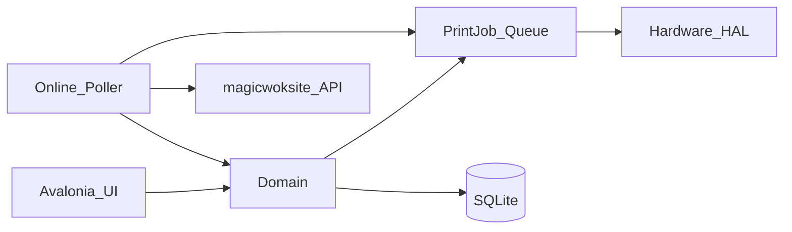

# Architecture

## Principles

1. **One Windows desktop app** — UI + hardware + online poller in one process (no “browser POS + localhost Edge”).
2. **Hardware is first-class** via a HAL; business code emits intents (`PrintKitchen`, `OpenDrawer`), not driver calls.
3. **Local SQLite is source of truth** for POS data in v1; website remains source of truth for **online** orders until claimed/printed.
4. **Website repo is never edited** from this project — only read for menu / print protocol / business facts.

## Solution layout

```
MagicWok.Epos.sln
src/
  MagicWok.Epos/              # Avalonia UI (MVVM)
  MagicWok.Epos.Domain/       # Orders, menu, shifts, customers
  MagicWok.Epos.Hardware/     # HAL: printers, drawer, CID, payment
  MagicWok.Epos.Online/       # Website getorder / callback client
  MagicWok.Epos.Data/         # SQLite + repositories
```

## Runtime flow



## Print jobs (learn from PosNext)

- Channels: `kitchen` | `front`
- States: `pending` → `claimed` → `printed` | `failed`
- **Idempotent complete** — never reprint forever on ack failure
- Payload builder separate from ESC/POS renderer
- **Acceptance = paper out**, not only DB status

## Settings store

JSON document in SQLite `settings` table (shop, tax, printers, online URLs/credentials, CID COM port, payment mode). All configurable inside EPOS — no web admin.

Online URL seed for this shop: base `https://magicwoksite.vercel.app` (see `docs/ONLINE_ORDERS.md`). Editable in Settings when the public domain changes.

## Data path

`%APPDATA%\MagicWok.Epos\data.sqlite`

## Menu seed

Embedded resources in `MagicWok.Epos.Data/Seed/` (copied from website `src/data/seed/live/`, restaurant JSON stripped of print secrets). On first launch, if `menu_items` is empty, `MenuSeeder` imports categories + items and fills shop name/address defaults.
